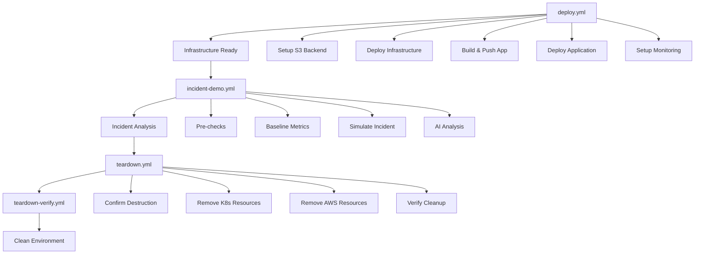

# 🚀 Automated SRE Workflows

This directory contains GitHub Actions workflows that fully automate your SRE infrastructure deployment, incident simulation, and teardown processes. These workflows replace the need for local script execution while maintaining security best practices.

## 📋 Available Workflows

### 1. 🚀 `deploy.yml` - Deploy SRE Infrastructure & Application
**Purpose**: Complete infrastructure and application deployment
**Replaces**: `deploy.sh` script

**Features**:
- ✅ S3 backend for Terraform state (secure, versioned)
- ✅ Automatic AWS resource provisioning
- ✅ Docker image build and ECR push
- ✅ Kubernetes application deployment
- ✅ Monitoring stack setup (Prometheus/Grafana)
- ✅ Kubernetes Dashboard installation
- ✅ Comprehensive verification

**Inputs**:
- `environment`: Choose deployment environment (demo/staging)
- `skip_monitoring`: Skip monitoring setup for faster deployment

**Duration**: ~20-30 minutes

### 2. 🚨 `incident-demo.yml` - Incident Simulation Demo
**Purpose**: Simulate and analyze production incidents
**Replaces**: `incident-demo.sh` script

**Features**:
- ✅ Multiple incident types (memory leak, CPU stress, health failure)
- ✅ Real-time metrics collection
- ✅ AI-powered incident analysis with AWS Bedrock
- ✅ Automatic log capture and S3 upload
- ✅ Comprehensive incident reporting

**Inputs**:
- `incident_type`: Type of incident to simulate
- `duration`: Duration in minutes
- `enable_ai_analysis`: Enable AI analysis with Claude Sonnet 4

**Duration**: ~5-15 minutes (depending on duration)

### 3. 🧹 `teardown.yml` - Teardown Infrastructure
**Purpose**: Safely destroy all AWS resources
**Replaces**: `teardown.sh` script

**Features**:
- ✅ Safety confirmation required ("DESTROY")
- ✅ Pre-teardown backup creation
- ✅ Kubernetes resource cleanup
- ✅ AWS resource destruction
- ✅ S3 and DynamoDB cleanup
- ✅ Cost impact reporting

**Inputs**:
- `confirm_destroy`: Must type "DESTROY" to proceed
- `skip_verification`: Skip post-teardown verification
- `force_destroy`: Force destroy (ignore errors)

**Duration**: ~10-20 minutes

### 4. ✅ `teardown-verify.yml` - Verify Teardown Completion
**Purpose**: Verify all resources are properly cleaned up
**Replaces**: `teardown-verify.sh` script

**Features**:
- ✅ Core resource verification (EKS, ECR, VPC)
- ✅ Detailed resource checking
- ✅ Billing impact assessment
- ✅ Auto-cleanup option
- ✅ Comprehensive reporting

**Inputs**:
- `detailed_check`: Perform detailed resource verification
- `check_billing`: Check for potential billing impact
- `auto_cleanup`: Attempt to clean up remaining resources

**Duration**: ~3-5 minutes

## 🔒 Security Features

### **State Management**
- ✅ **S3 Backend**: Terraform state stored securely in S3
- ✅ **Encryption**: Server-side encryption enabled
- ✅ **Versioning**: State file versioning for rollback
- ✅ **Locking**: DynamoDB table for state locking

### **Secrets Protection**
- ✅ **GitHub Secrets**: AWS credentials stored securely
- ✅ **No Hardcoding**: No sensitive data in workflow files
- ✅ **Masked Outputs**: Sensitive values automatically masked
- ✅ **Public Safe**: All workflows safe for public repositories

### **Access Control**
- ✅ **Manual Triggers**: All workflows require manual execution
- ✅ **Confirmation**: Destruction requires explicit confirmation
- ✅ **Audit Trail**: Complete execution history in GitHub

## 🚀 Quick Start Guide

### **Prerequisites**
1. **GitHub Secrets**: Configure `AWS_ACCESS_KEY_ID` and `AWS_SECRET_ACCESS_KEY`
2. **AWS Permissions**: Admin access or equivalent permissions
3. **Public Repository**: Workflows designed for public repos

### **Deployment Workflow**
1. Go to **Actions** → **Deploy SRE Infrastructure & Application**
2. Click **Run workflow**
3. Select environment and options
4. Wait for completion (~20-30 minutes)
5. Access your application via the provided URL

### **Incident Simulation Workflow**
1. Ensure infrastructure is deployed
2. Go to **Actions** → **Incident Simulation Demo**
3. Click **Run workflow**
4. Select incident type and duration
5. Monitor results and download artifacts

### **Teardown Workflow**
1. Go to **Actions** → **Teardown Infrastructure**
2. Click **Run workflow**
3. Type "DESTROY" in the confirmation field
4. Wait for completion (~10-20 minutes)
5. Verify with teardown-verify workflow if needed

## 📊 Workflow Architecture

## 💰 Cost Management

### **Estimated Costs**
- **Running Infrastructure**: ~$4-15/day (~$120-450/month)
- **Deployment**: ~$0.50 per deployment
- **Incident Simulation**: ~$0.10 per simulation
- **Teardown**: ~$0.20 per teardown

### **Cost Optimization**
- ✅ **Automatic Teardown**: Prevents forgotten resources
- ✅ **Resource Verification**: Ensures complete cleanup
- ✅ **Cost Reporting**: Shows estimated savings
- ✅ **Efficient Workflows**: Optimized resource usage

## 🔧 Troubleshooting

### **Common Issues**

#### **Workflow Fails to Start**
- Check GitHub Secrets are configured
- Verify AWS credentials have required permissions
- Ensure repository is public or has GitHub Actions enabled

#### **Terraform Backend Issues**
- S3 bucket and DynamoDB table are created automatically
- If backend init fails, check AWS permissions
- State bucket is unique per GitHub user/org

#### **Deployment Timeouts**
- EKS cluster creation can take 10-15 minutes
- Monitoring stack installation can take 15-20 minutes
- Increase timeout values if needed

#### **Teardown Incomplete**
- Run `teardown-verify.yml` to check remaining resources
- Use auto-cleanup option for stuck resources
- Manual cleanup may be needed for some resources

### **Debug Steps**
1. **Check Workflow Logs**: Detailed logs available in GitHub Actions
2. **Verify AWS Console**: Check resources in AWS Console
3. **Run Verification**: Use teardown-verify workflow
4. **Check Billing**: Monitor AWS billing dashboard

## 🎯 Best Practices

### **Development Workflow**
1. **Deploy**: Use deploy.yml for environment setup
2. **Test**: Run incident-demo.yml for testing
3. **Iterate**: Make changes and redeploy as needed
4. **Cleanup**: Always run teardown.yml when done

### **Security Practices**
1. **Rotate Credentials**: Regularly rotate AWS keys
2. **Monitor Usage**: Check AWS CloudTrail logs
3. **Limit Permissions**: Use least privilege principle
4. **Review Workflows**: Regularly review workflow execution

### **Cost Management**
1. **Monitor Spending**: Set up AWS Budgets
2. **Clean Up**: Always teardown when not in use
3. **Verify Cleanup**: Use teardown-verify workflow
4. **Track Usage**: Monitor workflow execution frequency

## 📚 Advanced Usage

### **Custom Environments**
- Modify environment variables in workflows
- Create additional workflow files for different environments
- Use different AWS accounts for isolation

### **Extended Monitoring**
- Add custom Grafana dashboards
- Configure additional Prometheus metrics
- Set up alerting rules

### **CI/CD Integration**
- Trigger workflows from other repositories
- Use workflow outputs in downstream processes
- Implement approval processes for production

## 🤝 Contributing

When contributing to workflows:
1. **Test Thoroughly**: Test all changes in your own AWS account
2. **Security Review**: Ensure no secrets are exposed
3. **Documentation**: Update this README for any changes
4. **Backward Compatibility**: Maintain compatibility with existing usage

## 📞 Support

For issues with workflows:
1. **Check Logs**: Review GitHub Actions logs
2. **Verify Setup**: Ensure prerequisites are met
3. **Test Locally**: Test components locally if possible
4. **Open Issue**: Create GitHub issue with detailed information

---

**⚠️ Important**: These workflows create AWS resources that incur costs. Always run the teardown workflow when done to avoid unexpected charges!