```mermaid
flowchart TD
    A[📱 Deploy App Only] --> B[Verify ECR Image]
    B --> C[Update Helm Values]
    C --> D[Deploy to K8s]
    D --> E[Monitor Rollout]
    E --> F[✅ Deployment Complete]
    
    D --> D1[Helm Upgrade]
    D --> D2[Pod Restart]
    D --> D3[Service Update]
```

# 🚀 SRE GitHub Actions Workflows

This directory contains automated GitHub Actions workflows that replace manual scripts with secure, scalable CI/CD automation. All workflows are designed for public repositories with proper secret management.

## 📊 Overall Workflow Architecture

This architecture shows the complete SRE workflow lifecycle from infrastructure deployment to incident analysis and cleanup.

## 📋 Available Workflows

### 1. 🚀 **`deploy.yml`** - Complete Infrastructure Deployment
**Purpose**: Deploy full SRE infrastructure and application  
**Replaces**: `deploy.sh` script  
**Trigger**: Manual (`workflow_dispatch`)

**What it does**:
- Sets up secure S3 backend for Terraform state
- Provisions AWS infrastructure (VPC, EKS, ECR, Lambda, DynamoDB)
- Builds and pushes Docker application to ECR
- Deploys application to Kubernetes with Helm
- Installs monitoring stack (Prometheus, Grafana)
- Sets up Kubernetes Dashboard

**Inputs**:
- `environment`: Deployment environment (demo/staging)
- `skip_monitoring`: Skip monitoring setup for faster deployment

**Duration**: ~20-30 minutes

```mermaid
flowchart TD
    A[🚀 Deploy Workflow] --> B[Setup S3 Backend]
    B --> C[Deploy Infrastructure]
    C --> D[Build & Push App]
    D --> E[Deploy Application]
    E --> F[Setup Monitoring]
    F --> G[Setup Dashboard]
    G --> H[Verify Deployment]
    H --> I[✅ Ready for Use]
    
    C --> C1[VPC + Subnets]
    C --> C2[EKS Cluster]
    C --> C3[Lambda Functions]
    C --> C4[DynamoDB Tables]
    
    E --> E1[Helm Install]
    E --> E2[Service Exposure]
    E --> E3[Health Checks]
    
    F --> F1[Prometheus]
    F --> F2[Grafana]
    F --> F3[Dashboards]
```

---

### 2. 🚨 **`incident-demo.yml`** - AI-Powered Incident Simulation
**Purpose**: Simulate incidents and analyze with AI  
**Replaces**: `incident-demo.sh` script  
**Trigger**: Manual (`workflow_dispatch`)

**What it does**:
- Captures baseline metrics before incident
- Simulates various incident types (memory leak, CPU stress, health failure)
- Collects real-time metrics during incident
- Uploads logs to S3 for analysis
- Runs AI analysis using AWS Bedrock & Claude Sonnet 4
- Generates comprehensive incident reports

**Inputs**:
- `incident_type`: Type to simulate (memory_leak/cpu_stress/health_failure/all_scenarios)
- `duration`: Duration in minutes (1-60)
- `enable_ai_analysis`: Enable AI-powered analysis

**Duration**: ~5-15 minutes

---

### 3. 🧹 **`teardown.yml`** - Infrastructure Teardown
**Purpose**: Safely destroy all AWS resources  
**Replaces**: `teardown.sh` script  
**Trigger**: Manual (`workflow_dispatch`)

**What it does**:
- Requires explicit "DESTROY" confirmation
- Removes Kubernetes resources first
- Destroys AWS infrastructure with Terraform
- Cleans up S3 buckets and DynamoDB tables
- Provides cost savings report

**Inputs**:
- `confirm_destroy`: Must type "DESTROY" to proceed
- `skip_verification`: Skip post-teardown verification
- `force_destroy`: Force destroy ignoring errors

**Duration**: ~10-20 minutes

```mermaid
flowchart TD
    A[🧹 Teardown] --> B{Confirm DESTROY?}
    B -->|No| X[❌ Cancelled]
    B -->|Yes| C[Backup State]
    C --> D[Remove K8s Resources]
    D --> E[Terraform Destroy]
    E --> F[Cleanup S3/DynamoDB]
    F --> G[Verify Cleanup]
    G --> H[💰 Cost Report]
    H --> I[✅ Clean Environment]
    
    D --> D1[Helm Uninstall]
    D --> D2[K8s Resources]
    D --> D3[Namespaces]
    
    E --> E1[Lambda Functions]
    E --> E2[EKS Cluster]
    E --> E3[VPC Resources]
    E --> E4[ECR Repository]
    
    classDef destroy fill:#FF6B6B,stroke:#FF6B6B,stroke-width:2px,color:#fff
    classDef cancelled fill:#c62828,stroke:#c62828,stroke-width:2px,color:#fff
    classDef default fill:#f9f9f9,stroke:#333,stroke-width:2px,color:#000
    
    class B destroy
    class X cancelled
```

---

### 4. ✅ **`teardown-verify.yml`** - Verify Complete Cleanup
**Purpose**: Verify all resources are properly cleaned up  
**Replaces**: `teardown-verify.sh` script  
**Trigger**: Manual (`workflow_dispatch`)

**What it does**:
- Checks for remaining AWS resources
- Verifies EKS, ECR, VPC, Lambda cleanup
- Estimates potential billing impact
- Offers auto-cleanup of remaining resources

**Inputs**:
- `detailed_check`: Perform detailed resource verification
- `check_billing`: Check for potential billing impact  
- `auto_cleanup`: Attempt to clean up remaining resources

**Duration**: ~3-5 minutes

```mermaid
flowchart TD
    A[✅ Verify Teardown] --> B[Check Core Resources]
    B --> C[Check EKS Clusters]
    C --> D[Check ECR Repos]
    D --> E[Check VPC Resources]
    E --> F[Check Lambda Functions]
    F --> G{Resources Found?}
    G -->|No| H[✅ All Clean]
    G -->|Yes| I[📋 Resource Report]
    I --> J{Auto Cleanup?}
    J -->|Yes| K[🔧 Auto Cleanup]
    J -->|No| L[⚠️ Manual Action Needed]
    K --> M[✅ Cleanup Complete]
    
    B --> B1[Cost Analysis]
    B --> B2[Billing Impact]
    
    classDef success fill:#10B981,stroke:#10B981,stroke-width:2px,color:#fff
    classDef warning fill:#f59e0b,stroke:#f59e0b,stroke-width:2px,color:#fff
    classDef default fill:#f9f9f9,stroke:#333,stroke-width:2px,color:#000
    
    class H success
    class L warning
```

---

### 5. 🔍 **`analyze-s3-logs.yml`** - Standalone Log Analysis
**Purpose**: Analyze any S3 log file with AI  
**Trigger**: Manual (`workflow_dispatch`)

**What it does**:
- Downloads log file from provided S3 URL
- Runs AI analysis using AWS Bedrock & Claude Sonnet 4
- Generates detailed incident analysis report
- Provides structured RCA and recommendations

**Inputs**:
- `s3_object_url`: S3 URL to log file (s3:// or https:// format)

**Duration**: ~2-5 minutes

---

### 6. 🏗️ **`build-push-deploy-app.yml`** - App-Only Deployment
**Purpose**: Build and deploy application only (no infrastructure)  
**Trigger**: Manual (`workflow_dispatch`)

**What it does**:
- Builds Docker image from application code
- Pushes to existing ECR repository
- Deploys to existing Kubernetes cluster
- Updates application without infrastructure changes

**Inputs**:
- `image_tag`: Docker image tag (default: latest)
- `namespace`: Kubernetes namespace (default: default)

**Duration**: ~5-10 minutes

```mermaid
flowchart TD
    A[🏗️ Build & Deploy App] --> B[Build Docker Image]
    B --> C[Push to ECR]
    C --> D[Update K8s Deployment]
    D --> E[Wait for Rollout]
    E --> F[Verify Health]
    F --> G[✅ App Updated]
    
    B --> B1[Docker Build]
    B --> B2[Tag Image]
    
    D --> D1[Helm Upgrade]
    D --> D2[Rolling Update]
    D --> D3[Health Checks]
```

---

### 7. 📱 **`deploy-app-only.yml`** - Deploy Pre-built App
**Purpose**: Deploy application using existing image  
**Trigger**: Manual (`workflow_dispatch`)

**What it does**:
- Deploys application using specified image
- No building - uses existing ECR image
- Updates Kubernetes deployment only
- Fastest deployment option

**Inputs**:
- `image_tag`: ECR image tag to deploy
- `namespace`: Target Kubernetes namespace

**Duration**: ~2-5 minutes

---

## 🔄 Workflow Dependencies & Order

This diagram shows how workflows can be combined for different development scenarios and phases.

## 🔒 Security & Best Practices

### **State Management**
- ✅ **S3 Backend**: Terraform state stored securely in encrypted S3
- ✅ **State Locking**: DynamoDB prevents concurrent modifications
- ✅ **Versioning**: State file history for rollback capability
- ✅ **Isolation**: Branch-specific state keys prevent conflicts

### **Secret Management**
- ✅ **GitHub Secrets**: AWS credentials stored securely
- ✅ **No Hardcoding**: Zero sensitive data in workflow files
- ✅ **Output Masking**: Sensitive values automatically hidden
- ✅ **Public Safe**: All workflows safe for public repositories

### **Access Control**
- ✅ **Manual Triggers**: All workflows require explicit execution
- ✅ **Confirmation Gates**: Destructive actions require confirmation
- ✅ **Audit Trail**: Complete execution history in GitHub Actions

## 💰 Cost Management

### **Estimated Costs**
| Component | Cost/Day | Cost/Month |
|-----------|----------|------------|
| EKS Cluster | $2.40 | $72 |
| EC2 Nodes (t3.medium x2) | $3.50 | $105 |
| Load Balancer | $0.60 | $18 |
| Other Resources | $1.50 | $45 |
| **Total Running** | **~$8/day** | **~$240/month** |

### **Workflow Costs**
- Deploy: ~$0.50 per run
- Incident Demo: ~$0.10 per run  
- Teardown: ~$0.20 per run
- AI Analysis: ~$0.05 per analysis

## 🚀 Quick Start

### **Prerequisites**
1. Configure GitHub Secrets:
   - `AWS_ACCESS_KEY_ID`
   - `AWS_SECRET_ACCESS_KEY`
2. AWS IAM permissions for EC2, EKS, ECR, S3, Lambda, DynamoDB
3. Public repository (or GitHub Actions enabled)

### **Basic Workflow**
1. **Deploy**: Run `deploy.yml` → Wait 20-30 minutes
2. **Test**: Run `incident-demo.yml` → Analyze results  
3. **Iterate**: Use `build-push-deploy-app.yml` for updates
4. **Cleanup**: Run `teardown.yml` → Verify with `teardown-verify.yml`

### **Development Workflow**
1. **Initial Setup**: `deploy.yml` (full infrastructure)
2. **Code Changes**: `build-push-deploy-app.yml` (app only)
3. **Quick Deploy**: `deploy-app-only.yml` (existing image)
4. **Testing**: `incident-demo.yml` (incident simulation)
5. **Analysis**: `analyze-s3-logs.yml` (standalone analysis)

## 🔧 Troubleshooting

### **Common Issues**

| Issue | Solution |
|-------|----------|
| Workflow won't start | Check GitHub Secrets configuration |
| Terraform backend error | Verify AWS permissions for S3/DynamoDB |
| EKS timeout | Allow 15-20 minutes for cluster creation |
| App deployment fails | Check ECR repository exists and image is pushed |
| AI analysis fails | Verify AWS Bedrock access in us-west-1 |
| Incomplete teardown | Run `teardown-verify.yml` with auto-cleanup |

### **Debug Steps**
1. Check GitHub Actions logs for detailed error messages
2. Verify AWS Console for resource status
3. Use `teardown-verify.yml` to check remaining resources
4. Monitor AWS billing for unexpected charges

## 📊 Monitoring & Observability

After deployment, access:
- **Application**: Service URL provided in deploy workflow output
- **Grafana**: `http://SERVICE_URL/grafana` (admin/admin)
- **Prometheus**: `http://SERVICE_URL/prometheus`
- **Kubernetes Dashboard**: Token provided in workflow output

## 🤝 Contributing

When modifying workflows:
1. Test thoroughly in your own AWS account
2. Ensure no secrets are exposed in logs
3. Update this README for any changes
4. Maintain backward compatibility
5. Add appropriate error handling

---

**⚠️ Important**: These workflows create AWS resources that incur costs. Always run teardown workflows when finished to avoid unexpected charges!

**🔐 Security**: All workflows are designed for public repositories with proper secret management. Never commit AWS credentials to code.