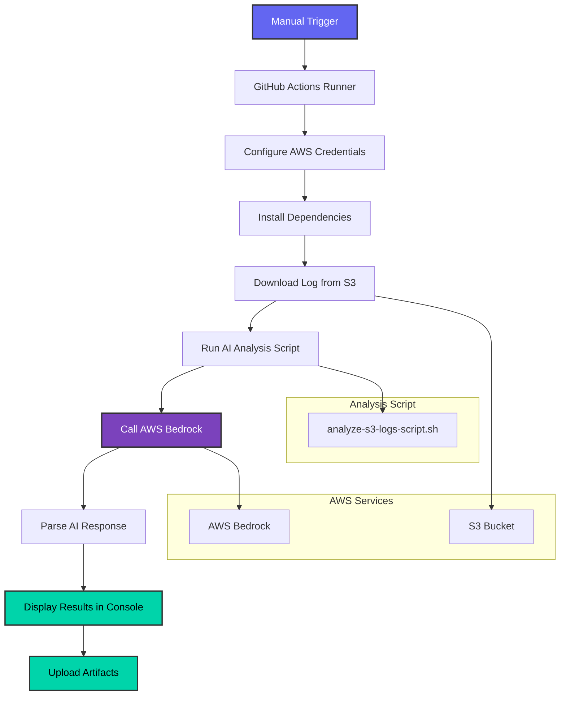

# GitHub Actions: S3 Log Analysis with Bedrock

## 🚀 Quick Start Instructions

### 1. Get S3 Object URL
1. Go to AWS S3 Console
2. Navigate to your bucket: `sre-incident-demo-incident-logs-XXXXX`
3. Find your incident log file in the `incidents/` folder
4. Click on the log file to open its properties
5. **Copy the Object URL** (see image below for reference)
   - Click the "Copy" button next to "Object URL"
   - Format: `https://bucket-name.s3.region.amazonaws.com/path/to/log.log`


*Reference: S3 Console showing how to copy Object URL from Properties tab*

### 2. Run GitHub Workflow
1. Go to your GitHub repository → Actions tab
2. Select "Analyze S3 Logs with Bedrock" workflow
3. Click "Run workflow"
4. Paste the S3 Object URL
5. Click "Run workflow"

## 📊 Workflow Architecture



## 🔄 How It Works

### Phase 1: Setup & Authentication
- **GitHub Actions Runner**: Ubuntu latest environment
- **AWS CLI Installation**: Handles existing installations gracefully
- **Credential Configuration**: Uses GitHub Secrets for secure access
- **Bedrock Verification**: Confirms model access before analysis

### Phase 2: Log Retrieval
- **URL Parsing**: Supports both S3 URI and HTTPS formats
- **S3 Download**: Retrieves log file from specified bucket/key
- **File Validation**: Checks file existence and size
- **Preview Display**: Shows first 500 characters for verification

### Phase 3: AI Analysis
- **Prompt Creation**: Uses temporary files to avoid JSON escaping issues
- **Bedrock Call**: Invokes Claude Sonnet 4 with structured prompt
- **Response Processing**: Extracts and formats AI analysis
- **Error Handling**: Graceful fallback for parsing issues

### Phase 4: Results & Artifacts
- **Console Display**: Shows formatted analysis in GitHub Actions logs
- **Full Response**: Displays complete Bedrock response for debugging
- **Artifact Upload**: Saves results for 7-day retention
- **Summary Statistics**: Shows token usage and response metadata

## 📋 Supported URL Formats

### HTTPS URL (Recommended)
```
https://sre-incident-demo-incident-logs-l35a3g7s.s3.eu-central-1.amazonaws.com/incidents/demo-incident-20250807-232440/incident-demo-incident-20250807-232440.log
```

### S3 URI
```
s3://sre-incident-demo-incident-logs-l35a3g7s/incidents/demo-incident-20250807-232440/incident-demo-incident-20250807-232440.log
```

## 🎯 Example Usage

### Step-by-Step Process
1. **Incident Occurs**: Your incident demo creates logs
2. **Logs Uploaded**: Logs are automatically pushed to S3
3. **Get URL**: Copy Object URL from S3 console
4. **Run Analysis**: Execute GitHub workflow with URL
5. **Review Results**: Check console output and download artifacts

### Console Output Example
```
=== FULL BEDROCK RESPONSE ===
📄 Bedrock Response File Contents:
{"id":"msg_bdrk_019jE6KgkeqE5eqFxzeg3ugU","type":"message","role":"assistant",...}

📊 Response Summary:
File size: 12345 bytes
Response ID: msg_bdrk_019jE6KgkeqE5eqFxzeg3ugU
Model used: claude-sonnet-4-20250514
Stop reason: end_turn
Input tokens: 3110
Output tokens: 956
=== END BEDROCK RESPONSE ===
```

## 📁 Artifacts Generated

After workflow completion, download the `analysis-results` artifact containing:
- `bedrock-response.json` - Raw Bedrock API response
- `incident-log.log` - Original log file from S3
- `analysis-results.txt` - Formatted analysis results

## 🔧 Configuration

### GitHub Secrets Required
```bash
AWS_ACCESS_KEY_ID=your_access_key
AWS_SECRET_ACCESS_KEY=your_secret_key
```

### AWS Permissions Needed
```json
{
    "Version": "2012-10-17",
    "Statement": [
        {
            "Effect": "Allow",
            "Action": ["s3:GetObject"],
            "Resource": "arn:aws:s3:::sre-incident-demo-incident-logs-*/*"
        },
        {
            "Effect": "Allow",
            "Action": ["bedrock:InvokeModel"],
            "Resource": "arn:aws:bedrock:us-west-1::foundation-model/us.anthropic.claude-sonnet-4-20250514-v1:0"
        }
    ]
}
```

## 🚨 Troubleshooting

### Common Issues & Solutions

| Issue | Solution |
|-------|----------|
| **Invalid S3 URL** | Use exact format: `https://bucket.s3.region.amazonaws.com/key` |
| **AWS Credentials Error** | Verify GitHub Secrets are set correctly |
| **Bedrock Access Denied** | Enable Bedrock in AWS console and grant model access |
| **Log File Not Found** | Check S3 URL and verify file exists |
| **Malformed Input Request** | Script handles JSON escaping automatically |

### Debug Information
The workflow provides comprehensive logging:
- ✅ AWS CLI version and installation status
- ✅ Bedrock model availability check
- ✅ S3 download progress and file size
- ✅ Analysis script execution details
- ✅ Full Bedrock response display

## 🔗 Integration Points

### With Incident Demo
1. **Local Analysis**: `scripts/analyze-incident-bedrock.sh` (uses `/tmp` logs)
2. **S3 Analysis**: This workflow (uses S3 logs)
3. **Log Flow**: `incident-demo.sh` → Local logs → S3 upload → This workflow

### With CI/CD Pipeline
- **Manual Trigger**: On-demand analysis of specific incidents
- **Automated**: Can be triggered after incident demos
- **Scheduled**: Regular analysis of new S3 logs

## 💡 Benefits

- **🌐 No Local Setup**: Runs entirely in GitHub Actions
- **🤖 Consistent AI Analysis**: Same model and prompt every time
- **📊 Structured Output**: JSON-formatted results with metadata
- **💾 Persistent Storage**: Results saved as artifacts for 7 days
- **🔍 Full Visibility**: Complete Bedrock response for debugging
- **📱 Cross-Platform**: Works from any device with web access

## 📈 Performance

- **Typical Runtime**: 30-60 seconds
- **Token Usage**: ~3000 input tokens, ~1000 output tokens
- **File Size Limit**: Handles logs up to several MB
- **Concurrent Runs**: Supports multiple simultaneous analyses
