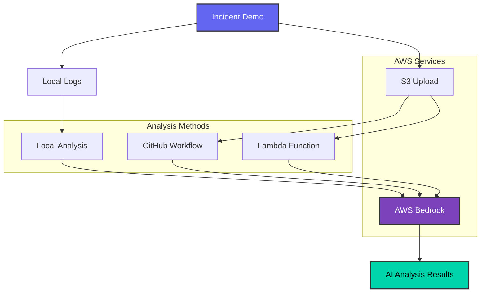

# 🤖 AI-Powered Incident Response System

This project now includes an advanced AI-powered incident response system that uses AWS Bedrock to automatically analyze incident logs and generate comprehensive Root Cause Analysis (RCA) reports.

## 🏗️ Architecture Overview



## 🧩 Components

### 1. **Enhanced Incident Demo Script** (`scripts/incident-demo.sh`)
- **Purpose**: Orchestrates the complete incident simulation with AI logging
- **Features**:
  - Automatic log capture at each phase
  - S3 upload of incident data
  - Integration with AI analysis
  - Real-time metrics and log collection

### 2. **S3 Log Storage** (`terraform/ai-incident-response.tf`)
- **Purpose**: Secure storage for incident logs and data
- **Features**:
  - Encrypted storage
  - Versioning enabled
  - Organized by incident ID
  - Automatic cleanup policies

### 3. **Lambda Function** (`lambda/incident-analyzer.py`)
- **Purpose**: AI-powered log analysis using AWS Bedrock
- **Features**:
  - Retrieves logs from S3
  - Analyzes with Claude 3 Sonnet
  - Generates structured RCA reports
  - Handles multiple incident types

### 4. **AI Analysis Script** (`scripts/analyze-incident.sh`)
- **Purpose**: User-friendly interface for triggering AI analysis
- **Features**:
  - Command-line interface
  - Beautiful formatted output
  - Configurable parameters
  - Error handling

## 🚀 Quick Start

### 1. **Deploy Infrastructure**
```bash
# Build Lambda function
./scripts/build-lambda.sh

# Deploy infrastructure (includes S3 and Lambda)
cd terraform
terraform apply
cd ..
```

### 2. **Run Incident Demo with AI**
```bash
# Run the enhanced incident demo
./scripts/incident-demo.sh
```

### 3. **Analyze with AI** (if not run automatically)
```bash
# Analyze the incident
./scripts/analyze-incident.sh -i demo-incident-20241201-143022
```

## 📊 AI Analysis Output

The AI analysis provides comprehensive insights in the following categories:

### **Incident Summary**
- Incident type and severity
- Duration and affected services
- Timeline of events

### **Root Cause Analysis**
- Primary cause identification
- Contributing factors
- Event timeline

### **Immediate Fixes**
- High-priority actions
- Step-by-step resolution
- Emergency procedures

### **Preventive Measures**
- Long-term solutions
- Implementation timeline
- Best practices

### **Lessons Learned**
- Key takeaways
- Process improvements
- Team insights

### **Recommendations**
- Monitoring improvements
- Infrastructure changes
- Process enhancements
- Code quality suggestions

## 🔧 Configuration

### **Environment Variables**
```bash
# Set Grafana password (optional)
export GRAFANA_PASSWORD="your-secure-password"

# AWS region (default: eu-central-1)
export AWS_REGION="eu-central-1"
```

### **Lambda Configuration**
The Lambda function is configured with:
- **Runtime**: Python 3.11
- **Memory**: 512 MB
- **Timeout**: 300 seconds
- **Dependencies**: boto3, botocore

### **S3 Bucket Configuration**
- **Encryption**: AES256
- **Versioning**: Enabled
- **Public Access**: Blocked
- **Lifecycle**: 7-day retention for logs

## 📝 Usage Examples

### **Basic Incident Analysis**
```bash
./scripts/analyze-incident.sh
```

### **Specific Incident Analysis**
```bash
./scripts/analyze-incident.sh -i memory-leak-001 -t memory_leak -r 60
```

### **Custom Time Range**
```bash
./scripts/analyze-incident.sh -r 120  # Analyze last 2 hours
```

## 🔍 What Gets Logged

The system captures comprehensive data during incidents:

### **Application Logs**
- Pod logs and status
- Resource usage metrics
- Kubernetes events
- Health check results

### **Metrics Snapshots**
- Memory usage patterns
- CPU utilization
- Network statistics
- Application health status

### **Incident Timeline**
- Phase transitions
- Key actions taken
- Resolution steps
- Verification results

## 🛡️ Security Features

### **Data Protection**
- All logs encrypted at rest
- Secure S3 bucket policies
- IAM role-based access
- No sensitive data in logs

### **Access Control**
- Lambda function with minimal permissions
- S3 bucket with restricted access
- Bedrock access limited to specific model

## 💰 Cost Considerations

### **AWS Services Used**
- **S3**: ~$0.023 per GB stored
- **Lambda**: ~$0.20 per 1M requests
- **Bedrock**: ~$0.003 per 1K input tokens
- **CloudWatch**: ~$0.50 per GB ingested

### **Estimated Costs**
- **Small incident**: ~$0.10-0.50
- **Large incident**: ~$1.00-5.00
- **Monthly usage**: ~$5.00-20.00

## 🔄 Workflow

### **1. Incident Detection**
```bash
./scripts/incident-demo.sh
# Automatically captures logs and uploads to S3
```

### **2. AI Analysis**
```bash
./scripts/analyze-incident.sh -i <incident-id>
# Retrieves logs and generates RCA report
```

### **3. Action Planning**
- Review AI recommendations
- Implement immediate fixes
- Plan preventive measures
- Update monitoring

## 🎯 Benefits

### **For SRE Teams**
- **Faster Resolution**: AI identifies root causes quickly
- **Better Insights**: Comprehensive analysis of incidents
- **Learning**: Historical incident analysis
- **Automation**: Reduces manual analysis time

### **For Organizations**
- **Reduced MTTR**: Faster incident resolution
- **Improved Reliability**: Better preventive measures
- **Cost Savings**: Efficient resource utilization
- **Knowledge Retention**: Structured incident documentation

## 🚨 Troubleshooting

### **Common Issues**

#### **Lambda Function Not Found**
```bash
# Check if Lambda exists
aws lambda list-functions --region eu-central-1

# Rebuild and redeploy
./scripts/build-lambda.sh
cd terraform && terraform apply && cd ..
```

#### **S3 Upload Fails**
```bash
# Check AWS credentials
aws sts get-caller-identity

# Verify S3 bucket exists
aws s3 ls s3://your-bucket-name
```

#### **Bedrock Access Denied**
```bash
# Check Bedrock permissions
aws bedrock list-foundation-models --region eu-central-1

# Verify Lambda IAM role
aws iam get-role --role-name sre-incident-demo-incident-analyzer-lambda
```

### **Debug Mode**
```bash
# Enable verbose logging
export DEBUG=1
./scripts/analyze-incident.sh -i <incident-id>
```

## 🔮 Future Enhancements

### **Planned Features**
- **Real-time Analysis**: Stream processing of logs
- **Multi-language Support**: Analysis in different languages
- **Custom Models**: Fine-tuned models for specific domains
- **Integration**: Slack, PagerDuty, Jira integration
- **Dashboard**: Web-based analysis interface

### **Advanced Analytics**
- **Trend Analysis**: Historical incident patterns
- **Predictive Alerts**: Proactive incident prevention
- **Team Performance**: SRE team metrics
- **Cost Optimization**: Resource usage analysis

## 📚 Additional Resources

- [AWS Bedrock Documentation](https://docs.aws.amazon.com/bedrock/)
- [Lambda Best Practices](https://docs.aws.amazon.com/lambda/latest/dg/best-practices.html)
- [S3 Security Best Practices](https://docs.aws.amazon.com/AmazonS3/latest/userguide/security-best-practices.html)
- [SRE Incident Response](https://sre.google/sre-book/managing-incidents/)

---

**🎉 Congratulations!** You now have a state-of-the-art AI-powered incident response system that combines the best of SRE practices with cutting-edge AI technology. 