# 🏗️ Architecture Flowcharts

This document provides comprehensive flowcharts showing the architecture and data flow of the SRE Terraform EKS AWS Incident Scenario project.

## 🎯 **Better Visualization Options**

### **📱 For YouTube Video & Presentations:**

#### **Option 1: Mermaid Live Editor (Recommended)**
1. **Copy each Mermaid code block** from the sections below
2. **Go to**: https://mermaid.live/
3. **Paste the code** in the left panel
4. **Export as PNG/SVG** using the download button
5. **Use in your video** - much better quality and zoom!

#### **Option 2: VS Code Extensions**
- **Mermaid Preview**: Install "Mermaid Preview" extension
- **Markdown Preview Enhanced**: Install "Markdown Preview Enhanced"
- **Right-click** on Mermaid code → "Open Preview" → **Full-screen mode**

#### **Option 3: Online Tools**
- **Draw.io**: Import Mermaid code or recreate diagrams
- **Lucidchart**: Professional diagramming
- **Figma**: Modern design tool with diagram capabilities

#### **Option 4: Command Line Export**
```bash
# Install mermaid-cli
npm install -g @mermaid-js/mermaid-cli

# Export specific diagram
mmdc -i flowchart.mmd -o flowchart.png -b transparent

# Export all diagrams
for file in *.mmd; do
    mmdc -i "$file" -o "${file%.mmd}.png" -b transparent
done
```

### **🎬 YouTube Video Tips:**
- **Export as PNG** with high resolution (1920x1080 or higher)
- **Use full-screen** during presentation
- **Zoom in** on specific components when explaining
- **Add annotations** in video editing software
- **Show code** alongside diagrams for technical details

---

## 📋 Table of Contents

- [🏗️ Architecture Flowcharts](#️-architecture-flowcharts)
  - [🎯 **Better Visualization Options**](#-better-visualization-options)
    - [**📱 For YouTube Video \& Presentations:**](#-for-youtube-video--presentations)
      - [**Option 1: Mermaid Live Editor (Recommended)**](#option-1-mermaid-live-editor-recommended)
      - [**Option 2: VS Code Extensions**](#option-2-vs-code-extensions)
      - [**Option 3: Online Tools**](#option-3-online-tools)
      - [**Option 4: Command Line Export**](#option-4-command-line-export)
    - [**🎬 YouTube Video Tips:**](#-youtube-video-tips)
  - [📋 Table of Contents](#-table-of-contents)
  - [🎯 Complete System Overview](#-complete-system-overview)
  - [🏗️ Infrastructure Provisioning Flow](#️-infrastructure-provisioning-flow)
  - [🔄 CI/CD Pipeline Flow](#-cicd-pipeline-flow)
  - [🚀 Application Deployment Flow](#-application-deployment-flow)
  - [📊 Monitoring \& Observability Flow](#-monitoring--observability-flow)
  - [🚨 Incident Response \& AI Analysis Flow](#-incident-response--ai-analysis-flow)
  - [🔄 Data Flow Architecture](#-data-flow-architecture)
  - [📋 Architecture Summary](#-architecture-summary)
    - [**Key Components:**](#key-components)
    - [**Data Flow:**](#data-flow)
    - [**Key Benefits:**](#key-benefits)

---

## 🎯 Complete System Overview


---

## 🏗️ Infrastructure Provisioning Flow


---

## 🔄 CI/CD Pipeline Flow


---

## 🚀 Application Deployment Flow

```mermaid
graph TD
    subgraph "Docker Image"
        DOCKERFILE[Dockerfile]
        APP_CODE[Node.js Application]
        DOCKER_IMAGE[Docker Image]
    end
    
    subgraph "ECR Registry"
        ECR_REPO[ECR Repository]
        IMAGE_TAG[Image Tag]
    end
    
    subgraph "Kubernetes Deployment"
        HELM_CHART[Helm Chart]
        DEPLOYMENT[Deployment]
        SERVICE[Service]
        HPA[HPA]
        INGRESS[Ingress]
    end
    
    subgraph "EKS Cluster"
        NODES[Worker Nodes]
        PODS[Application Pods]
        LOAD_BALANCER[Load Balancer]
    end
    
    %% Docker Build
    DOCKERFILE --> DOCKER_IMAGE
    APP_CODE --> DOCKER_IMAGE
    
    %% ECR Push
    DOCKER_IMAGE --> ECR_REPO
    ECR_REPO --> IMAGE_TAG
    
    %% Kubernetes Deploy
    HELM_CHART --> DEPLOYMENT
    DEPLOYMENT --> PODS
    PODS --> SERVICE
    SERVICE --> LOAD_BALANCER
    DEPLOYMENT --> HPA
    SERVICE --> INGRESS
    
    %% Node Scheduling
    NODES --> PODS
    
    %% Health Checks
    PODS -->|Health Check| HEALTH[Health Status]
    HEALTH -->|Ready| READY[✅ Ready]
    HEALTH -->|Not Ready| NOT_READY[❌ Not Ready]
    
    classDef docker fill:#2496ED,stroke:#2496ED,stroke-width:2px,color:#fff
    classDef ecr fill:#FF9900,stroke:#232F3E,stroke-width:2px,color:#000
    classDef k8s fill:#326CE5,stroke:#326CE5,stroke-width:2px,color:#fff
    classDef health fill:#00D4AA,stroke:#00D4AA,stroke-width:2px,color:#000
    
    class DOCKERFILE,APP_CODE,DOCKER_IMAGE docker
    class ECR_REPO,IMAGE_TAG ecr
    class HELM_CHART,DEPLOYMENT,SERVICE,HPA,INGRESS,NODES,PODS,LOAD_BALANCER k8s
    class HEALTH,READY,NOT_READY health
```



---

## 📊 Monitoring & Observability Flow


---

## 🚨 Incident Response & AI Analysis Flow


---

## 🔄 Data Flow Architecture


---

## 📋 Architecture Summary

### **Key Components:**

1. **GitHub Repository**: Source code, CI/CD workflows, and configuration
2. **Local Development**: Docker builds, Terraform provisioning, kubectl management
3. **AWS Infrastructure**: VPC, EKS, ECR, S3, Lambda, Bedrock
4. **Kubernetes Resources**: Deployments, Services, HPA, Ingress
5. **Monitoring Stack**: Prometheus, Grafana, Alert Manager
6. **AI Incident Response**: Log capture, S3 storage, Lambda analysis, Bedrock RCA

### **Data Flow:**

1. **Code → Build → Deploy**: GitHub → Docker → ECR → Kubernetes
2. **Infrastructure**: Terraform → AWS → EKS → Monitoring
3. **Monitoring**: Application → Prometheus → Grafana → Alerts
4. **Incident Response**: Incident → Logs → S3 → Lambda → Bedrock → RCA

### **Key Benefits:**

- **Complete Automation**: From code push to production deployment
- **Comprehensive Monitoring**: Full-stack observability
- **AI-Powered Analysis**: Intelligent incident response
- **Scalable Architecture**: Production-ready design
- **Cost Optimization**: Efficient resource utilization

This architecture demonstrates a modern, cloud-native SRE environment with AI-enhanced incident response capabilities. 