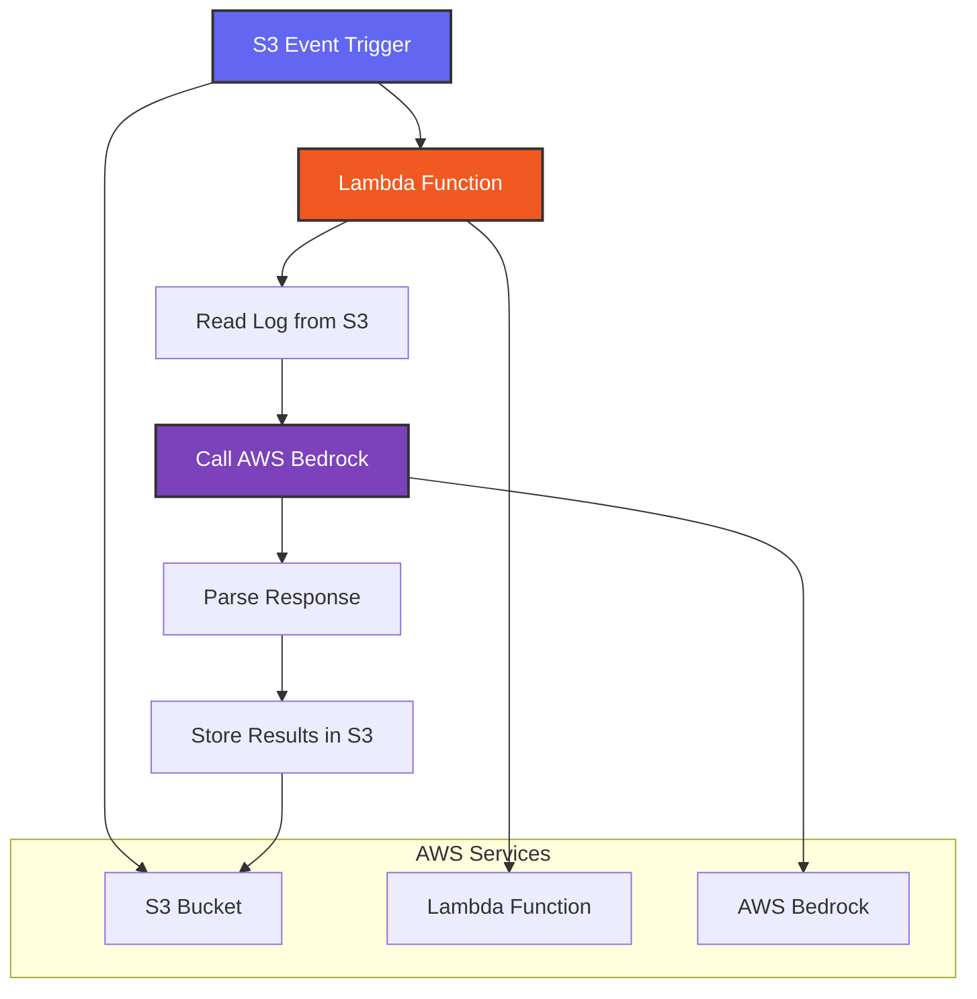

# Lambda Analysis Architecture

## Overview
The Lambda function provides an alternative approach to incident log analysis, but with specific limitations and use cases.

## Architecture



## Limitations

### 1. **Local File Processing Only**
- **Lambda Function**: Processes logs stored in S3 bucket
- **Local Script**: `scripts/analyze-incident-bedrock.sh` processes logs from `/tmp` directory
- **Same Core Logic**: Both use identical Bedrock API calls and analysis prompts

### 2. **Trigger-Based vs Manual**
- **Lambda**: Automatically triggered by S3 events (when new logs are uploaded)
- **Local Script**: Manually executed after incident demos
- **GitHub Workflow**: Manually triggered with S3 Object URL

### 3. **Processing Scope**
- **Lambda**: Processes individual log files as they're uploaded to S3
- **Local Script**: Processes logs generated by `incident-demo.sh` in real-time
- **GitHub Workflow**: Processes any S3 log file on-demand

## Comparison Table

| Aspect | Lambda Function | Local Script | GitHub Workflow |
|--------|----------------|--------------|-----------------|
| **Trigger** | S3 Event | Manual | Manual |
| **Input Source** | S3 Bucket | `/tmp` directory | S3 Object URL |
| **Processing** | Individual files | Real-time logs | On-demand |
| **Output** | S3 storage | Console display | Console + artifacts |
| **Use Case** | Automated analysis | Demo analysis | Post-demo analysis |

## Implementation Details

### Lambda Function
- **Runtime**: Python 3.9+
- **Memory**: 512MB (sufficient for log processing)
- **Timeout**: 30 seconds
- **Permissions**: S3 read/write, Bedrock invoke

### Core Analysis Logic
Both Lambda and local script use the same analysis approach:
1. **Log Reading**: Parse incident log content
2. **Prompt Creation**: Generate structured analysis prompt
3. **Bedrock Call**: Invoke Claude Sonnet 4 model
4. **Response Parsing**: Extract structured analysis
5. **Output Formatting**: Display results in readable format

### JSON Escaping Solution
Both implementations use the same technique to avoid "Malformed input request" errors:
- **Temporary Files**: Create prompt and payload files
- **jq Processing**: Use `jq -Rs .` for proper JSON escaping
- **File-based Calls**: Use `file://` parameter for AWS CLI

## Use Cases

### Lambda Function
- **Automated Analysis**: Process logs as they're uploaded
- **Batch Processing**: Handle multiple incident logs
- **Integration**: Part of automated incident response pipeline

### Local Script
- **Demo Analysis**: Real-time analysis during incident demos
- **Development**: Testing and debugging analysis logic
- **Offline Analysis**: Work with local log files

### GitHub Workflow
- **Post-Demo Analysis**: Analyze logs after incident demos
- **Manual Review**: On-demand analysis of specific incidents
- **Team Collaboration**: Share analysis results via artifacts

## File Structure

```
lambda/
├── lambda-analysis-architecture.md  ← This file
├── invoke-lambda-analysis.sh        ← Lambda invocation script
└── lambda-results-from-s3-bedrock/  ← Lambda analysis results
```

## Integration Points

### With Incident Demo
1. **Local Demo**: `incident-demo.sh` → Local logs → `analyze-incident-bedrock.sh`
2. **S3 Upload**: `incident-demo.sh` → S3 logs → Lambda function (automatic)
3. **Manual Analysis**: S3 logs → GitHub workflow (manual)

### Data Flow
```
incident-demo.sh
├── Creates logs in /tmp
├── Pushes logs to S3
└── Triggers Lambda (if configured)

Analysis Options:
├── Local: analyze-incident-bedrock.sh (immediate)
├── Lambda: Automatic S3 event trigger
└── GitHub: Manual workflow trigger
```

## Recommendations

### When to Use Each Approach

1. **Lambda Function**:
   - ✅ Automated incident response
   - ✅ High-volume log processing
   - ✅ Integration with existing S3 workflows

2. **Local Script**:
   - ✅ Real-time demo analysis
   - ✅ Development and testing
   - ✅ Offline analysis capabilities

3. **GitHub Workflow**:
   - ✅ Manual post-demo analysis
   - ✅ Team collaboration
   - ✅ Detailed debugging and artifacts

### Best Practices
- **Consistent Analysis**: All three approaches use identical Bedrock prompts
- **Error Handling**: Same JSON escaping techniques across all implementations
- **Output Format**: Consistent structured analysis format
- **Documentation**: Each approach has specific use cases and limitations
